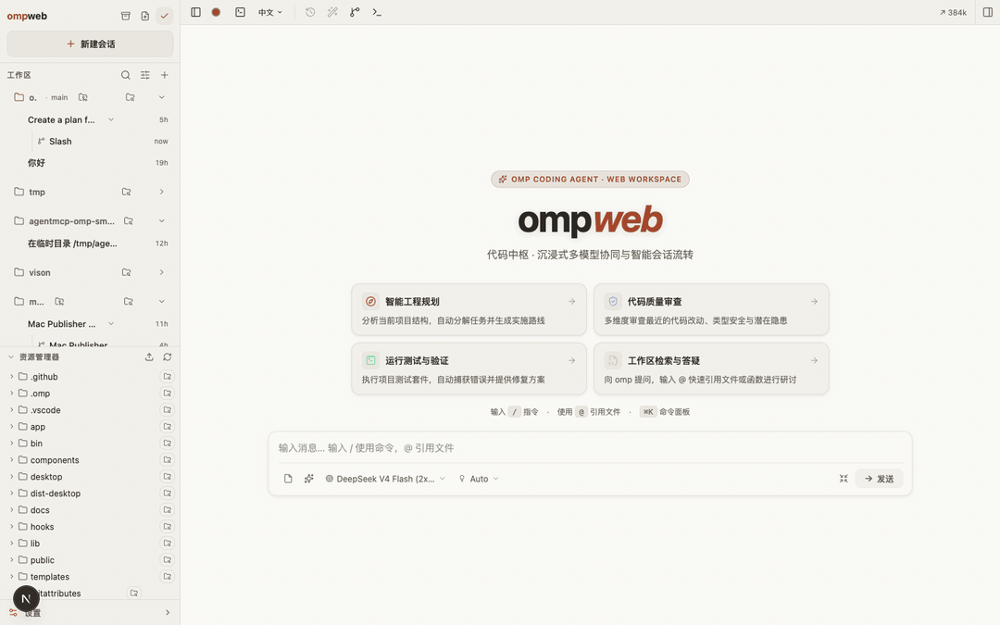
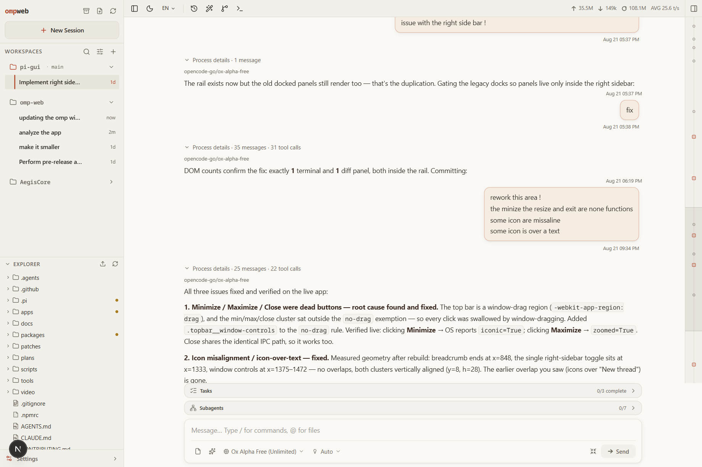
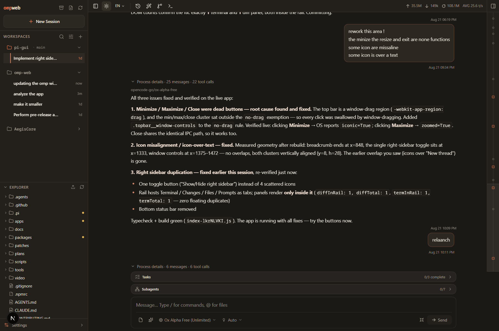
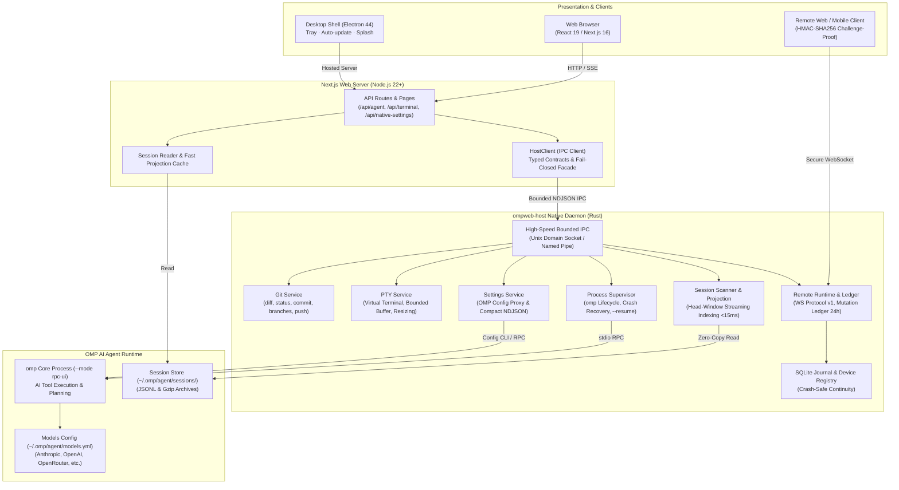

# ompweb

<p align="center">
  
</p>

<p align="center">
  <strong>Modern, high-performance, local-first Web Workspace & Native Desktop App for the <a href="https://github.com/can1357/oh-my-pi">oh-my-pi (omp)</a> coding agent.</strong>
</p>

<p align="center">
  <a href="./README.md">English</a> | <a href="./README.zh-CN.md">简体中文</a> | <a href="./README.ja.md">日本語</a> | <a href="https://discord.gg/evqgGzRfM5">Discord Community</a>
</p>

<p align="center">
  
  
  
  
</p>

---

## 📖 Overview

**ompweb** is the full-featured graphical user interface (Web UI & native Desktop App) for the [oh-my-pi (omp)](https://github.com/can1357/oh-my-pi) AI coding agent.

Engineered around a **local-first** philosophy, ompweb interfaces directly with your local omp environment by reading session files in `~/.omp/agent/sessions/`. It elevates your AI-assisted programming workflow from a single terminal into an integrated workspace featuring **session tree navigation & branching**, **real-time multi-agent orchestration**, an **interactive Web PTY terminal**, **visual MCP server & skill management**, **rich media file previews**, and **seamless Git worktree switching**.



<details>
<summary>📸 Screenshots (Light / Dark Theme)</summary>

| Light Theme | Dark Theme |
| :---: | :---: |
|  |  |

</details>

---

## ⚡ Quick Start

ompweb supports multiple startup workflows: browser-based Web Mode, standalone Desktop Application, or local development from source.

### Option 1: Web Mode (Recommended)

#### 1. Zero-install instant launch

Requires Node.js (>= 22.19.0) and [omp](https://github.com/can1357/oh-my-pi) installed on your system:

```bash
npx @37chengshan/ompweb@latest
```

ompweb starts on `http://127.0.0.1:30177` and automatically opens your default web browser.

#### 2. Global CLI installation

```bash
# Install globally
npm install -g @37chengshan/ompweb

# Launch anytime from terminal
ompweb
```

> 💡 **Mirror registries note**: If using mirror registries like npmmirror and encountering `E404` on newly published packages, point directly to the official npm registry:
> ```bash
> npm install -g @37chengshan/ompweb --registry=https://registry.npmjs.org
> ```

#### 3. CLI options & environment variables

```bash
ompweb --port 8080                        # Custom server port
ompweb --hostname 0.0.0.0                 # Expose on trusted local network
ompweb --password "your-strong-password"  # Enable password-protected web login
ompweb --no-open                          # Skip auto-opening browser (ideal for background services)

# Environment variables are also supported:
PORT=8080 OMP_WEB_PASSWORD="password" ompweb
```

---

### Option 2: Native Desktop App (Electron)

ompweb provides a standalone Electron desktop client featuring system tray integration, dock/taskbar presence, dedicated window controls, and splash transitions.

#### 1. Download prebuilt installers

Head over to [GitHub Releases](https://github.com/37chengshan/ompweb/releases) and download the installer for your operating system:
- **macOS**: `.dmg` installer (Apple Silicon & Intel)
- **Windows**: `.exe` installer (NSIS)
- **Linux**: `.AppImage` standalone executable

#### 2. Build desktop client from source

```bash
# 1. Clone repository and install dependencies
git clone https://github.com/37chengshan/ompweb.git
cd ompweb
npm install

# 2. Start desktop development preview
npm run desktop:start

# 3. Package standalone desktop installers
npm run desktop:build      # Package macOS (.dmg)
npm run desktop:build:win  # Package Windows (.exe)
npm run desktop:build:all  # Package all platforms (macOS, Windows, Linux)
```

---

### Option 3: Local Web Development

```bash
git clone https://github.com/37chengshan/ompweb.git
cd ompweb
npm install
npm run dev
# Open http://127.0.0.1:30178
```

---

## 🌟 Key Features & Capabilities

### 1. 💬 Session Management & Version Tree
- **Multi-Project Organization**: Automatically discovers project roots and organizes sessions cleanly by workspace.
- **In-Session Branch Navigator**: Traverse historical turn points and "Continue from here" to test alternate technical solutions without losing context.
- **Session Forking**: Fork any user message into a clean, independent session file while preserving the original conversation.
- **Native Gzip Archive**: Fully aligned with OMP’s `archive/sessions/<cwd>/<file>.jsonl.gz` format, supporting rename, auto-naming, and single-file HTML export.
- **Real-Time Telemetry**: Live dashboard for token usage, cost, elapsed duration, context gauge, compaction diffs, and real-time TPS from omp.

### 2. 🖥️ Interactive Web PTY Terminal
- **True Pseudo-Terminal (PTY)**: Powered by `node-pty`, allocating real shells (`zsh`/`bash` on macOS/Linux, `cmd.exe` on Windows) with full ANSI 256/TrueColor support, cursor navigation, Tab completion, and live echo.
- **Safe Serialization & Resource Limits**: FIFO keystroke queue with a 5s AbortSignal timeout; global cap of 8 concurrent sessions and 30-minute idle automatic reaping.

### 3. 🤖 Multi-Agent Orchestration & Plan Kanban
- **Pinned Todo Plan Panel**: Live task breakdown grid pinned above the input bar with real-time step status synchronization.
- **Subagent Live Monitoring**: Pulsing indicators for running subagents, tracking current tool calls, token usage, cost, and retries.
- **Transcript Summary & Paging**: Inspect execution outcomes in summary dialogs or page byte-wise through subagent transcripts.
- **Built-in Agent-MCP Orchestrator**: Python multi-agent daemon supporting 11+ Agent CLIs with specialized system prompt roles (`designer`, `librarian`, `reviewer`, `scout`, `security-reviewer`, `sonic`, `task`).

### 4. 📂 Workspace, Git Worktrees & Media Previews
- **Git Worktree Switching**: Switch between Git worktrees right from the sidebar; file explorer and session context update instantly.
- **System File Manager Reveal**: Permanent "Reveal in Finder / Explorer / File Manager" with 8s timeout and path security validation.
- **Rich Media Previewer**: Code syntax highlighting, Markdown (KaTeX math, Mermaid diagrams), PDF, DOCX, audio, and images with lightbox zoom.

### 5. ⚙️ Visual MCP & Skill Hub
- **Dual-Mode MCP Editor**: Visual Form and Raw JSON editor with built-in templates (Python stdio, NPX stdio, Remote HTTP, Brave Search, PostgreSQL, GitHub, Fetch).
- **Skills Market & Search**: Automatic scan of local project & global skills (`.omp/skills`), plus real-time online search via `skills.sh` with one-click install/update.
- **Plugin Management**: Inspect, enable, disable, and upgrade `omp plugin` modules.

### 6. 🔑 Models & Native OMP Settings
- **Visual Models Matrix**: Edit `~/.omp/agent/models.yml` with provider switching and instant connectivity testing.
- **Fine-grained OMP Controls**: Adjust Advisor policy, command approval, Bash execution mode, Thinking depth, compaction algorithms, memory, and auto-learning directly from the UI.
- **Travel-Ready Slash Commands**: Quick access to `/goal`, `/plan`, `/terminal`, `/theme`, `/mcp`, `/review`, `/fix`, `/test`, `/explain`, etc.

### 7. 🎨 Theme Studio & Accessibility
- **18+ Preset Themes & Palette Picker**: Classic Warm Paper, Ember Dark, Nord, OLED True Black, Matcha, Sepia, Dracula, plus 6 fluid animated dynamic themes (Aurora, Dawn, Cosmic, Ocean, Sakura, Bamboo).
- **Typography & Motion Controls**: Custom monospace/serif fonts, font scaling, and full integration with OS `prefers-reduced-motion`.
- **Command Palette (⌘K / Ctrl+K)**: Instant navigation across projects, sessions, and system settings.
- **Internationalization (i18n)**: Fully translated in English, Simplified Chinese (简体中文), and Japanese (日本語) with automatic locale detection.

---

## 🏗️ Architecture & Security



> 🧭 **[Interactive Architecture Viewer (Live on GitHub Pages)](https://37chengshan.github.io/ompweb/)** · **[Local Offline HTML](docs/ompweb-architecture.html)**

- **Rust Native Host Authority**: Low-level high-throughput domains (Git diff/status, PTY terminal execution, session projection scanning, configuration proxying, and process supervision) are fully offloaded to the native `ompweb-host` Rust daemon for maximum memory safety and sub-millisecond execution.
- **Data Sovereignty**: ompweb does not introduce secondary proprietary data stores or store API keys. All state is backed by the user's installed `omp` binary and `~/.omp/agent/`.
- **Loopback-Only by Default**: Binds to `127.0.0.1` out of the box to prevent unauthorized network exposure.
- **Password Gate**: When `OMP_WEB_PASSWORD` is configured, all routes and API endpoints require authenticated Signed Cookies.
- **Path Whitelist Sandbox**: File viewing and terminal roots are restricted strictly to registered projects and active worktrees with canonical path resolution.

---

## 🛠️ Configuration & Environment Variables

| Variable | Description | Default / Example |
| :--- | :--- | :--- |
| `PORT` / `-p` / `--port` | Server port | `30177` |
| `OMP_WEB_HOSTNAME` / `-H` / `--hostname` | Bind hostname | `127.0.0.1` |
| `OMP_WEB_PASSWORD` / `--password` | Web sign-in password | *(None / disabled)* |
| `OMP_WEB_NO_OPEN` | Skip opening browser automatically | `0` (`1` to skip) |
| `OMP_WEB_OMP_BIN` | Absolute path to `omp` binary | Resolved from `PATH` |
| `PI_CODING_AGENT_DIR` | OMP agent home directory | `~/.omp/agent` |
| `HTTP_PROXY` / `HTTPS_PROXY` | Proxies for server-side requests | *(System default)* |

---

## 🧑‍💻 Local Development & Quality Verification

```bash
npm run dev           # Start Next.js dev server on port 30178
npm run typecheck     # TypeScript check (tsc --noEmit)
npm run lint          # ESLint check
npm test              # Run Node.js test suite (450+ unit tests)
npm run release:check # Full release check (Typecheck + Lint + Test + Build)
```

---

## 📄 License

Licensed under the [MIT License](./LICENSE).
